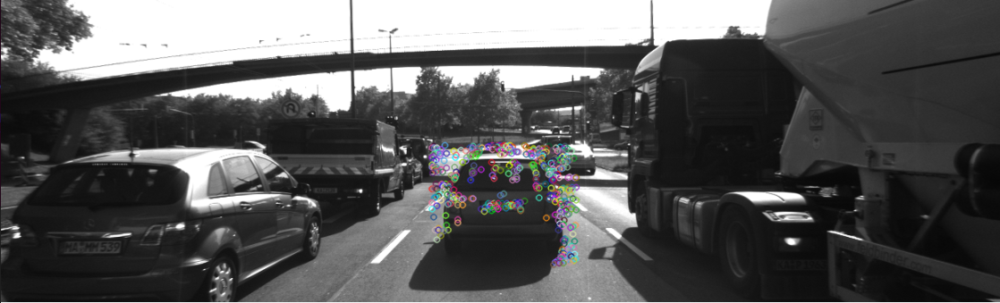
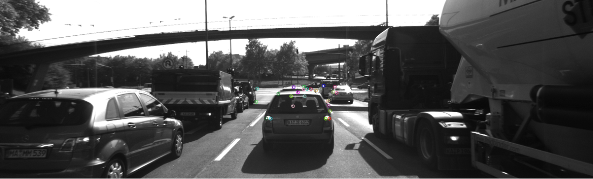
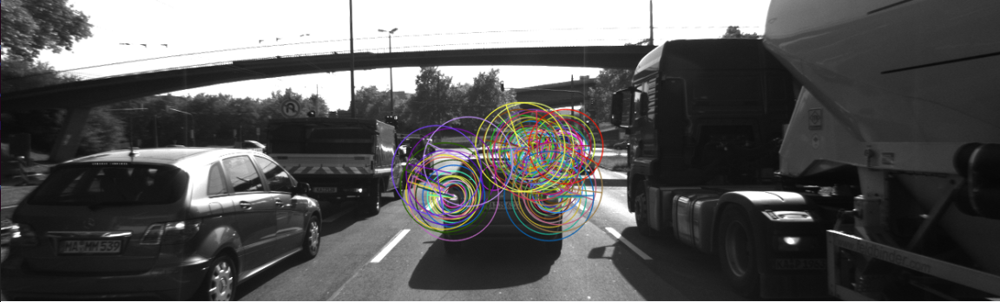
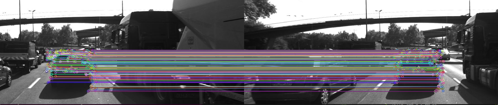

# SFND 2D Feature Tracking


The idea of the camera course is to build a collision detection system - that's the overall goal for the Final Project. As a preparation for this, you will now build the feature tracking part and test various detector / descriptor combinations to see which ones perform best. This mid-term project consists of four parts:

* First, you will focus on loading images, setting up data structures and putting everything into a ring buffer to optimize memory load. 
* Then, you will integrate several keypoint detectors such as HARRIS, FAST, BRISK and SIFT and compare them with regard to number of keypoints and speed. 
* In the next part, you will then focus on descriptor extraction and matching using brute force and also the FLANN approach we discussed in the previous lesson. 
* In the last part, once the code framework is complete, you will test the various algorithms in different combinations and compare them with regard to some performance measures. 

See the classroom instruction and code comments for more details on each of these parts. Once you are finished with this project, the keypoint matching part will be set up and you can proceed to the next lesson, where the focus is on integrating Lidar points and on object detection using deep-learning. 

## Dependencies for Running Locally
1. cmake >= 2.8
 * All OSes: [click here for installation instructions](https://cmake.org/install/)

2. make >= 4.1 (Linux, Mac), 3.81 (Windows)
 * Linux: make is installed by default on most Linux distros
 * Mac: [install Xcode command line tools to get make](https://developer.apple.com/xcode/features/)
 * Windows: [Click here for installation instructions](http://gnuwin32.sourceforge.net/packages/make.htm)

3. OpenCV >= 4.1
 * All OSes: refer to the [official instructions](https://docs.opencv.org/master/df/d65/tutorial_table_of_content_introduction.html)
 * This must be compiled from source using the `-D OPENCV_ENABLE_NONFREE=ON` cmake flag for testing the SIFT and SURF detectors. If using [homebrew](https://brew.sh/): `$> brew install --build-from-source opencv` will install required dependencies and compile opencv with the `opencv_contrib` module by default (no need to set `-DOPENCV_ENABLE_NONFREE=ON` manually). 
 * The OpenCV 4.1.0 source code can be found [here](https://github.com/opencv/opencv/tree/4.1.0)

4. gcc/g++ >= 5.4
  * Linux: gcc / g++ is installed by default on most Linux distros
  * Mac: same deal as make - [install Xcode command line tools](https://developer.apple.com/xcode/features/)
  * Windows: recommend using either [MinGW-w64](http://mingw-w64.org/doku.php/start) or [Microsoft's VCPKG, a C++ package manager](https://docs.microsoft.com/en-us/cpp/build/install-vcpkg?view=msvc-160&tabs=windows). VCPKG maintains its own binary distributions of OpenCV and many other packages. To see what packages are available, type `vcpkg search` at the command prompt. For example, once you've _VCPKG_ installed, you can install _OpenCV 4.1_ with the command:
```bash
c:\vcpkg> vcpkg install opencv4[nonfree,contrib]:x64-windows
```
Then, add *C:\vcpkg\installed\x64-windows\bin* and *C:\vcpkg\installed\x64-windows\debug\bin* to your user's _PATH_ variable. Also, set the _CMake Toolchain File_ to *c:\vcpkg\scripts\buildsystems\vcpkg.cmake*.


## Basic Build Instructions

1. Clone this repo.
2. Make a build directory in the top level directory: `mkdir build && cd build`
3. Compile: `cmake .. && make`
4. Run it: `./2D_feature_tracking`.


# CODE EXPLANATION

Provide a Writeup / README that includes all the rubric points and how you addressed each one. You can submit your writeup as markdown or pdf.

## Data Buffer

### MP.1 Data Buffer Optimization


Existing Data Buffer was optimized by implementing a simple circular buffer:

        DataFrame frame;
        frame.cameraImg = imgGray;
   
        if (dataBuffer.size() == dataBufferSize)
        {
            dataBuffer.erase(dataBuffer.begin());
            dataBuffer.push_back(frame);
        }
        else
            dataBuffer.push_back(frame);


## Keypoints

### MP.2 Keypoint Detection

Implement detectors HARRIS, FAST, BRISK, ORB, AKAZE, and SIFT and make them selectable by setting a string accordingly.

In Keypoint Detection part Shi-Tomasi, Harris, FAST, BRISK, ORB, AKAZE and SIFT based keypoint detection was implemented.

Shi-Tomasi was implemented in:
`void detKeypointsShiTomasi(std::vector<cv::KeyPoint> &keypoints, cv::Mat &img, bool bVis=false);`,

Harris:
`void detKeypointsHarris(std::vector<cv::KeyPoint> &keypoints, cv::Mat &img, bool bVis=false);`

while binary detectors FAST, BRISK, ORB, AKAZE and SIFT were implemented in: 
`void detKeypointsModern(std::vector<cv::KeyPoint> &keypoints, cv::Mat &img, std::string detectorType, bool bVis=false);`

Detector is selectable by setting a string in *MidTermProject_Camera_Student.cpp*, line 85.

### MP.3 Keypoint Removal 

Remove all keypoints outside of a pre-defined rectangle and only use the keypoints within the rectangle for further processing.

To simplify the analysis we focused on the preceeding vehicle only. This was done by implementing a rectangle using the `cv::Rect`. 

`cv::Rect vehicleRect(535, 180, 180, 150);`

Rectangle was then used to filter out all the keypoint outside of its area. Filter was implmented using Lambda function

`keypoints.erase(std::remove_if(keypoints.begin(), keypoints.end(),[vehicleRect](cv::KeyPoint kp){return !(vehicleRect.contains(kp.pt));}), keypoints.end());`

## Descriptors

### MP.4 Keypoint Descriptors 

Implement descriptors BRIEF, ORB, FREAK, AKAZE and SIFT and make them selectable by setting a string accordingly.

For keypoint description BRIEF, ORB, FREAK, AKAZE and SIFT descriptors have been implemented in 

`void descKeypoints(std::vector<cv::KeyPoint> &keypoints, cv::Mat &img, cv::Mat &descriptors, std::string descriptorType);`

Individual descriptors can be chosen by setting the a string in *MidTermProject_Camera_Student.cpp*, line 153.

### MP.5 Descriptors Matching and MP.6 Descriptors Distance Ratio
Implement FLANN matching as well as k-nearest neighbor selection. Both methods must be selectable using the respective strings in the main function.

Besides Brute Force matching, both FLANN and k-nearest neighboor selection for descriptor matching was implemented. 

Both FLANN and KNN were implemented as by first instatiating the matcher depending of the string value and later running it. 

 
  else if (matcherType.compare("MAT_FLANN") == 0)
  {

        if (descSource.type() != CV_32F)
        { // OpenCV bug workaround : convert binary descriptors to floating point due to a bug in current OpenCV implementation
            descSource.convertTo(descSource, CV_32F);
            descRef.convertTo(descRef, CV_32F);
        }

        matcher = cv::DescriptorMatcher::create(cv::DescriptorMatcher::FLANNBASED);
  }


  else if (selectorType.compare("SEL_KNN") == 0)
  { 
        vector<vector<cv::DMatch>> knn_matches;

        double t = (double)cv::getTickCount();
        matcher->knnMatch(descSource, descRef, knn_matches, 2);
        t = ((double)cv::getTickCount() - t) / cv::getTickFrequency();
        cout << " (KNN) with n=" << knn_matches.size() << " matches in " << 1000 * t / 1.0 << " ms" << endl;
       
       
        // TODO : filter matches using descriptor distance ratio test

        double distance_ratio = 0.8;
        for(auto it=knn_matches.begin(); it!=knn_matches.end(); ++it)
        {
            if((*it)[0].distance < distance_ratio * (*it)[1].distance)
                matches.push_back((*it)[0]);

        }
        cout << "# matches after applying descriptor distance ratio of 0.8 = " << matches.size() << endl;

  }

As it can be seen in the code within the K-Nearest-Neighbour section the descriptor distance test was implemented as well with the goal to improve the matches quality by removing the pairs of keypoints that fall below the 0.8 ratio of best vs. second-best match.


## Performance

### MP.7 Performance Evaluation 1 - Keypoints number and distribution on the preceeding vehicle
Count the number of keypoints on the preceding vehicle for all 10 images and take note of the distribution of their neighborhood size. Do this for all the detectors you have implemented.

Results of this performance evaluation can be seen in the *Mid-term.xls* file on sheet *MP.7*.

In this section all the implemented detectors were evaluated for performance with the focus on the number of keypoints detected on the preceeding vehicle and their distribution. It can be seen that applying FAST detector results in the highest number of keypoints in general and in highest number of keypoint on thhe preceeding vehicle's areas of interest such as license plate, stoplights, VW sign and edges of the vehicle. Also the CPU computational intensity of the FAST algorithm seems to be the lowest resulting  in the highest number of detected keypoints (cca 4900 on the entire image) and the fastest detection speed of cca. 1.7ms. 

<p align = "center">

</p>
<p align = "center">
Fig.1 - FAST detection results
</p>


Other algorithm such as Harris (HOG) or, for example, AKAZE (Binary) result in a smaller number of detection on the preceeeding vehicle. 

<p align = "center">

</p>
<p align = "center">
Fig.2 - Harris detection results
</p>

ORB is notable for its high speed but underperforms when compared with FAST on keypoint distribution on the preceeding vehicle. 

<p align = "center">

</p>
<p align = "center">
Fig.3 - ORB detection results
</p>


### MP.8 Performance Evaluation 2 - Number of matched keypoints


Results of this performance evaluation can be seen in the *Mid-term.xls* file on sheet *MP.8 & MP.9*.

In this step all detector - descriptor combinations were used to produce matches between keypoints on the preceeding vehicle on the 2 subsequent images. For the matcher type BF approach was used with the descriptor distance ratio set to 0.8. It should be noted that some detector - descriptor combinations were incompatible - SIFT was not functional when paired with ORB while AKAZE descriptor could only be used if keypoints were detected using AKAZE detector.

### MP.9 Performance Evaluation 3 - Detection/Description time logging and conclusion.

Results of this performance evaluation can be seen in the *Mid-term.xls* file on sheet *MP.8 & MP.9*.


<p align = "center">

</p>
<p align = "center">
Fig.4 - FAST / BRIEF matching results
</p>


Based on speed of detection/description, distribution of keypoints in relation to the preceeding vehicle and number of achived matches between keypoints  TOP 3 detector/descriptor combinations for detecting and matching keypoints on the preceeding vehicle would be:

1. FAST/BRIEF
2. FAST/ORB
3. FAST/SIFT


